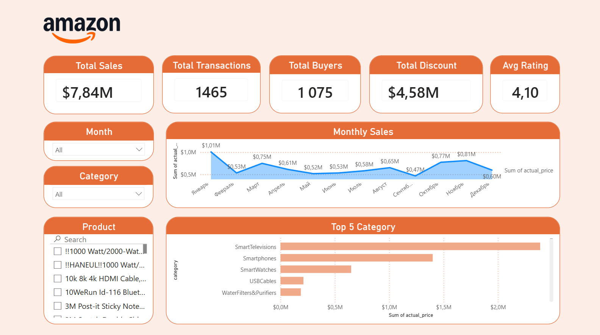

# Amazon Sales Dashboard

## Overview

Interactive sales analytics dashboard built in **Power BI** for monitoring Amazon marketplace performance.

## Key Metrics

- **Total Sales:** $7.84M
- **Total Transactions:** 1,465
- **Total Buyers:** 1,075
- **Total Discount:** $4.58M
- **Avg Rating:** 4.10 / 5.0

## Features

- Monthly sales trend visualization
- Filter by month
- Filter by category

## Key Insights

| Metric | Value |
|--------|-------|
| Average Transaction Value | $5,352 |
| Revenue per Buyer | $7,293 |
| Discount Rate | ~37% of total sales |

## Data Sources

The dashboard is built from **3 Excel tables**:

| Table | Description |
|-------|-------------|
| `transactions.xlsx` | Sales transaction records |
| `customers.xlsx` | Buyer information |
| `products.xlsx` | Product categories and pricing |

## Data Modeling

- Relationships established between tables (customer ID, product ID)
- Measures created using DAX for KPIs
- Calendar table for time intelligence

## Tech Stack

- **Visualization:** Power BI Desktop
- **Data Source:** Microsoft Excel (3 tables)
- **DAX:** Calculated measures and columns

